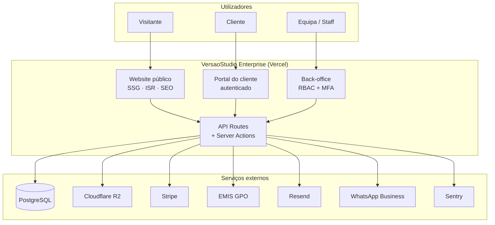
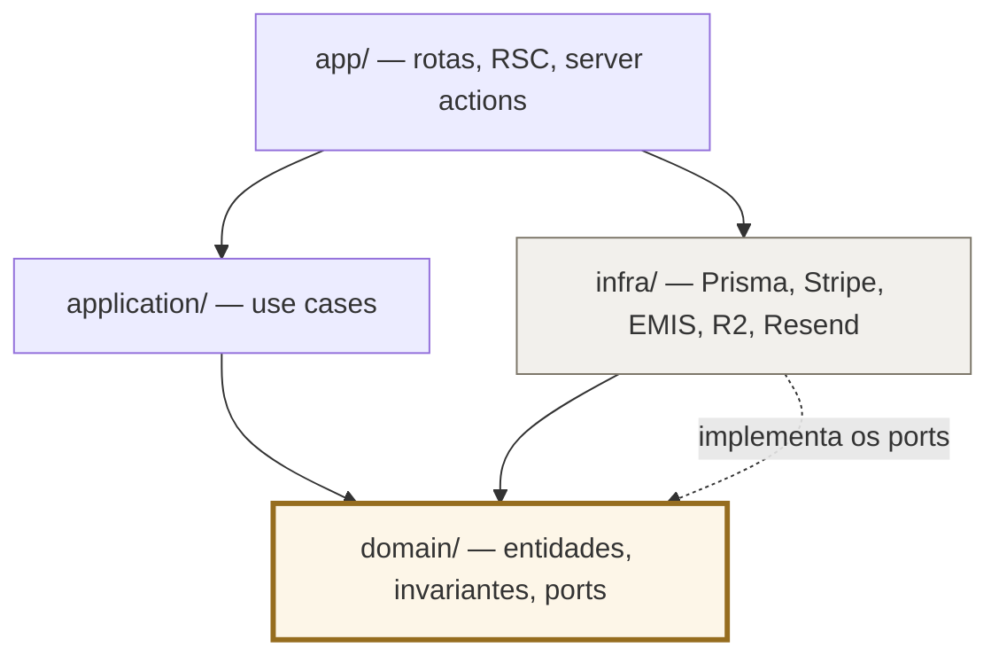
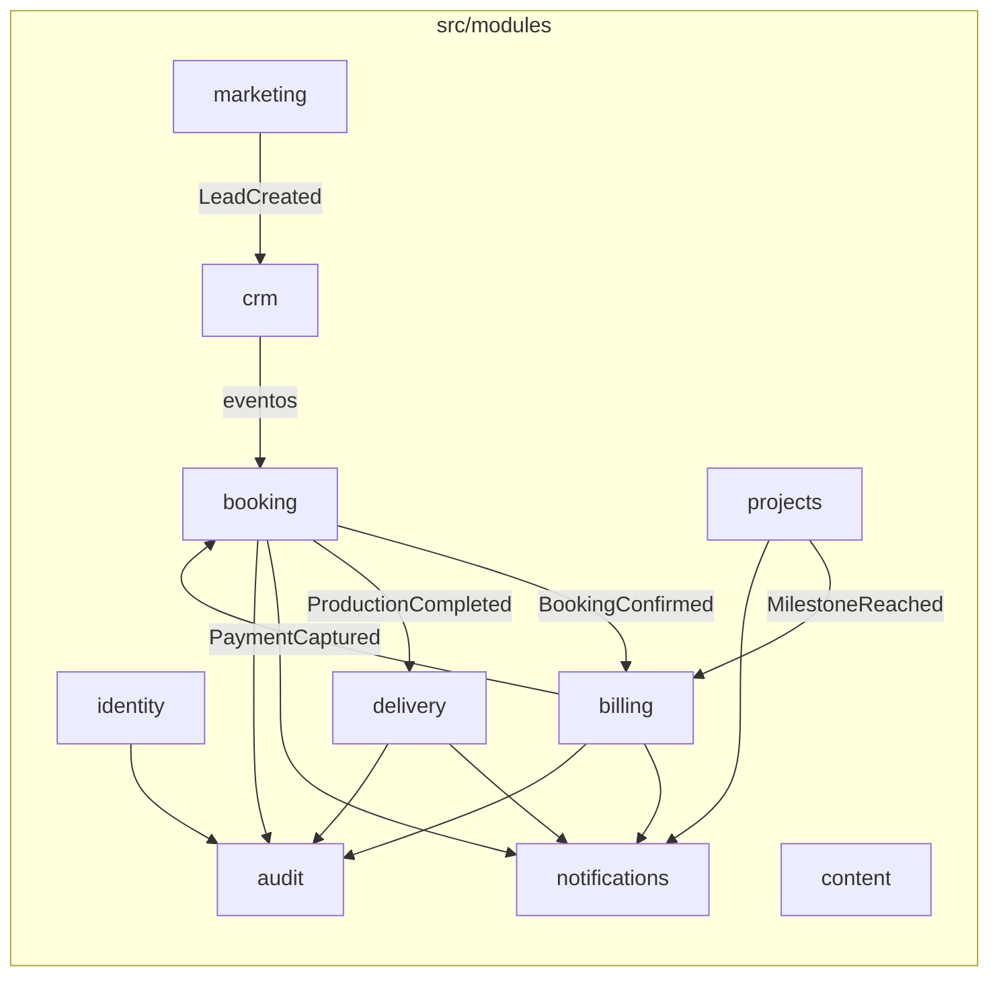
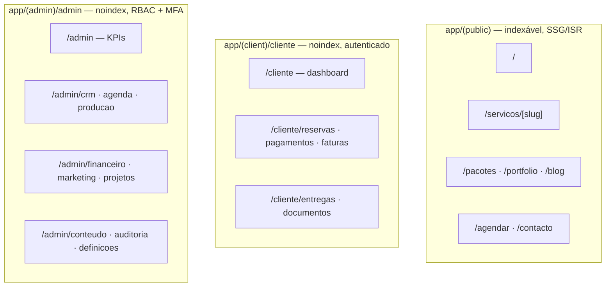
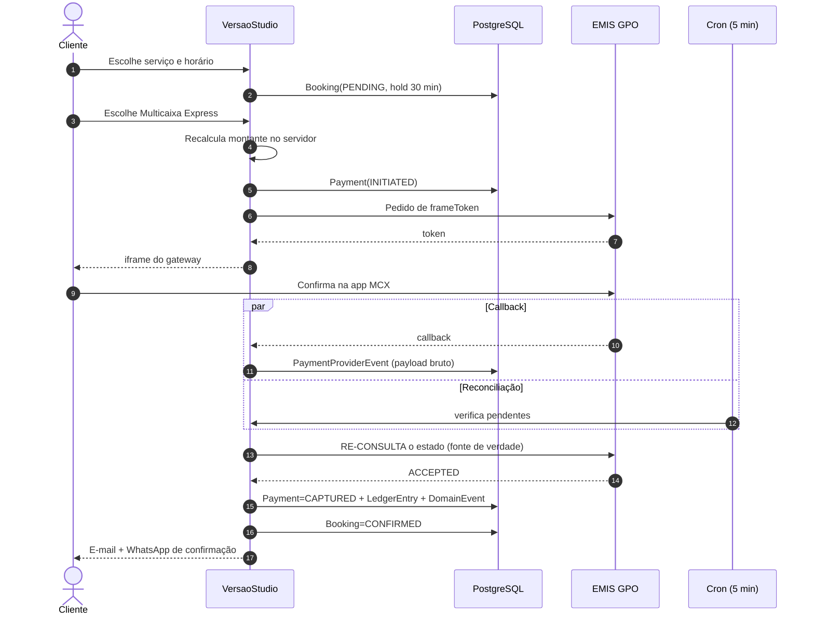
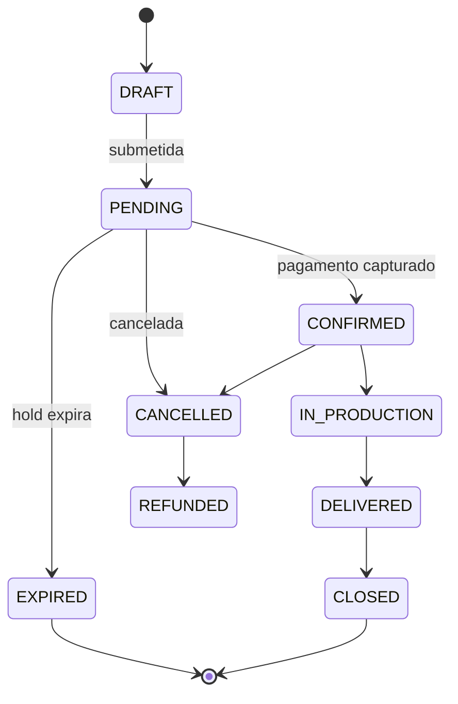
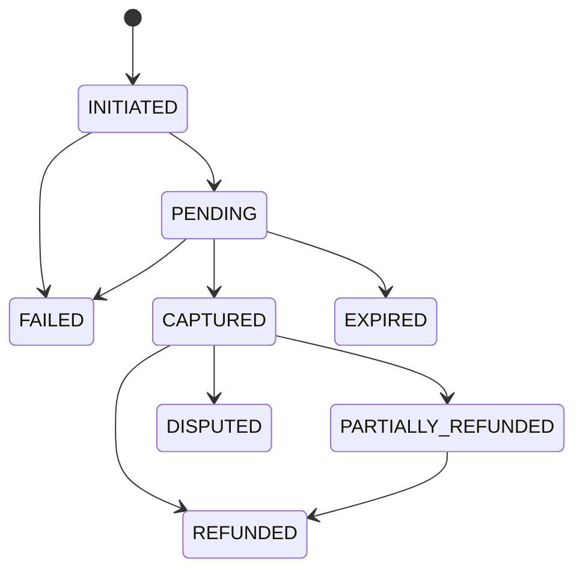
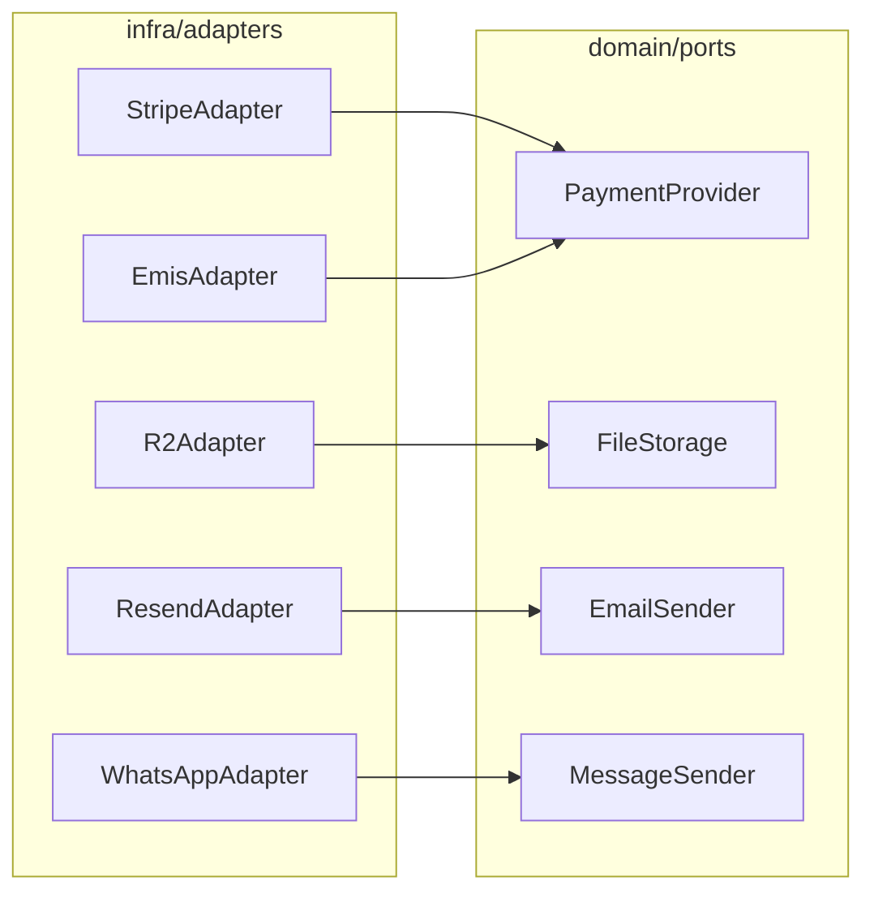
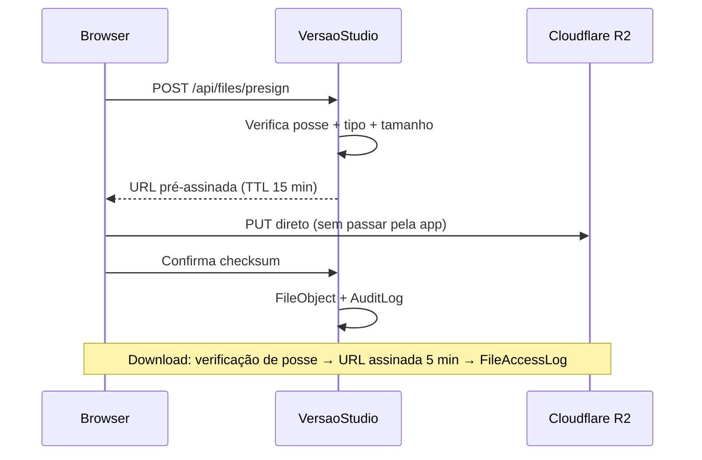
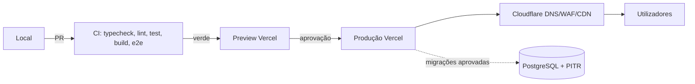

# Arquitetura — VersaoStudio Enterprise

**Documento canónico de arquitetura da Fase 0.**
Detalhe complementar (rotas completas, contratos de API, testes) em
[`../architecture/system-architecture.md`](../architecture/system-architecture.md).

---

## 1. Decisão estrutural

**Monólito modular Next.js**, uma base de código, uma base de dados PostgreSQL, três contextos
de interface e fronteiras de módulo impostas em CI.

Justificação completa em [`ADR-002`](../adr/ADR-002-monolito-modular.md). Em resumo: uma
empresa, uma equipa pequena, domínios que partilham constantemente as mesmas entidades, e
transações financeiras que beneficiam de `BEGIN...COMMIT` em vez de sagas distribuídas.

---

## 2. Vista de contexto

---

## 3. Camadas (Clean Architecture)

**Regra de dependência:** as setas apontam sempre para o domínio. `domain/` não importa
Prisma, Next, React nem SDKs externos. Verificado por `eslint-plugin-boundaries` — a violação
parte o build, não gera um aviso.

---

## 4. Módulos e fronteiras

Comunicação entre módulos: **apenas** através do `index.ts` público ou de eventos de domínio
persistidos no outbox (`DomainEvent`). Nenhum módulo lê tabelas de outro.

---

## 5. Contextos de interface

---

## 6. Fluxo de dados — reserva com pagamento EMIS

O fluxo mais crítico do sistema. Detalhe e defesas em
[`ADR-006`](../adr/ADR-006-stripe-emis-hibrido.md).

**Invariante:** o callback é um gatilho, nunca uma fonte de verdade. Callback e cron convergem
no mesmo verificador idempotente.

---

## 7. Máquinas de estado

---

## 8. Integrações

| Integração | Papel | Contrato | Modo de falha |
|---|---|---|---|
| **Stripe** | Cartões internacionais | Webhook assinado + dedupe por `event.id` | Degradação: só EMIS disponível |
| **EMIS GPO** | Multicaixa Express, referência, cartão local | iframe + callback + **polling obrigatório** | Callback perdido → resolvido pelo cron |
| **Cloudflare R2** | Entregas e assets | URLs pré-assinadas, upload direto do browser | Upload falha → retoma; app nunca faz proxy de bytes |
| **Resend** | E-mail transacional | API REST, fila com retry | Fila persiste; retry com backoff |
| **WhatsApp Business** | Notificações no canal dominante | API | Fallback para e-mail |
| **Sentry** | Erros, traces, replay | SDK | Falha silenciosa; nunca bloqueia o pedido |

**Anti-corruption layer:** nenhum SDK externo aparece em `domain/` ou `application/`. Trocar
de provedor de e-mail é trocar um adapter.

---

## 9. Fluxo de ficheiros

A aplicação nunca transporta bytes de vídeo. Isto mantém o serverless dentro dos limites de
tempo e memória, e o custo previsível.

---

## 10. Deployment

Migrações expand/contract, sempre retrocompatíveis. Rollback = redeploy do build anterior.
Nunca `DROP` no mesmo deploy que remove o uso da coluna.

---

## 11. Restrições que moldaram estas decisões

| Restrição | Consequência arquitetural |
|---|---|
| Rede angolana instável | RSC, payload mínimo, uploads retomáveis, estado otimista |
| Callback EMIS não garantido | Polling obrigatório; callback é apenas gatilho |
| AOA + moedas estrangeiras | Inteiros na menor unidade + `currency`; nunca `Float` |
| Vídeo 4K e RAW | Upload direto para R2; retenção com purga automática |
| Equipa pequena | Monólito modular; convenções impostas por CI |
| SEO existente é ativo | 301s testados em E2E; migração faseada e reversível |
| Lei n.º 22/11 (proteção de dados) | Minimização, retenção definida, trilho de auditoria |

---

## 12. Critérios de aceite da arquitetura

- [ ] `domain/` compila sem qualquer dependência de infraestrutura
- [ ] Violação de fronteira entre módulos parte o build
- [ ] Todos os endpoints de dinheiro são idempotentes e testados com pedidos repetidos
- [ ] Nenhuma query de cliente sem filtro de posse (verificado por teste)
- [ ] Os 5 URLs antigos respondem 301 para o destino correto
- [ ] Sentry recebe erros de servidor e browser com `release` e sourcemaps
- [ ] Reserva confirma em < 5 min mesmo com o callback do gateway perdido
