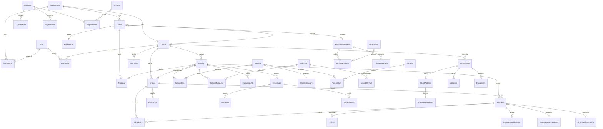

# 02 — Mapa de Domínio (DDD)

**Linguagem ubíqua em português de Angola.** O código usa inglês para tipos e tabelas;
a UI e a documentação de negócio usam os termos abaixo. A tradução é fixa e obrigatória.

| Termo de negócio | Modelo | Notas |
|---|---|---|
| Lead | `Lead` | Contacto ainda não convertido |
| Cliente | `Client` | Pessoa singular ou empresa com relação comercial |
| Reserva | `Booking` | Compromisso de data/serviço |
| Sessão | `ProductionJob` | Execução operacional de uma reserva |
| Orçamento / Proposta | `Proposal` | Documento comercial com validade |
| Fatura | `Invoice` | Documento fiscal |
| Pagamento | `Payment` | Tentativa de cobrança junto de um provedor |
| Entrega | `Deliverable` | Conjunto de ficheiros finais |
| Campanha | `MarketingCampaign` | Ação de marketing com orçamento e métricas |
| Projeto | `SaaSProject` | Trabalho de desenvolvimento de site/SaaS |

---

## 1. Bounded contexts e agregados

### 1.1 Identity & Access

**Agregados:** `Organization` (raiz), `User`, `Membership`, `Invitation`

Papéis (RBAC):

| Papel | Alcance |
|---|---|
| `OWNER` | Tudo, incluindo faturação da própria plataforma |
| `ADMIN` | Tudo exceto destruição de organização |
| `FINANCE_MANAGER` | Financeiro, faturas, reconciliação, reembolsos |
| `PRODUCER` | Agenda, produção, entregas |
| `EDITOR` | Conteúdo, SEO, marketing |
| `SALES` | CRM, propostas |
| `STAFF` | Leitura da agenda e das suas tarefas |
| `CLIENT` | Apenas os seus próprios dados |

**Invariantes**
- Uma organização tem sempre ≥ 1 `OWNER` ativo.
- Um `CLIENT` nunca tem `Membership` no back-office.
- Permissão é resolvida no servidor; o cliente nunca decide o que pode ver.

---

### 1.2 CRM

**Agregados:** `Lead` (raiz), `Client` (raiz), `Proposal` (raiz), `Activity`

Estados de `Lead`: `NEW → CONTACTED → QUALIFIED → PROPOSAL_SENT → WON | LOST`
Estados de `Proposal`: `DRAFT → SENT → ACCEPTED | REJECTED | EXPIRED`

**Invariantes**
- Um `Lead` só transita para `WON` se existir `Client` associado.
- `Proposal` aceite congela preços — alterações posteriores criam nova versão.
- Toda a origem de lead é rastreável: `LeadSource` + UTM + `referrer`.

**Eventos:** `LeadCreated`, `LeadQualified`, `ProposalSent`, `ProposalAccepted`, `ClientCreated`

---

### 1.3 Booking & Production

**Agregados:** `Booking` (raiz), `ProductionJob` (raiz), `AvailabilityRule`, `Resource`

Estados de `Booking`:
```
DRAFT → PENDING ──(pagamento capturado)──▶ CONFIRMED ──▶ IN_PRODUCTION ──▶ DELIVERED ──▶ CLOSED
          │                                    │
          ├──(hold expira)──▶ EXPIRED          └──▶ CANCELLED ──▶ REFUNDED
```

**Invariantes (as mais importantes do sistema)**
1. Não existem duas reservas `CONFIRMED` a ocupar o mesmo `Resource` no mesmo intervalo.
   Garantido por **constraint de exclusão em PostgreSQL** (`btree_gist` sobre `tstzrange`),
   não apenas por lógica de aplicação.
2. `PENDING` bloqueia o slot por `holdExpiresAt` (30 min por omissão); expirado, liberta.
3. O preço é sempre recalculado no servidor a partir da `PriceList` ativa à data.
4. Transição para `CONFIRMED` exige `Payment.status = CAPTURED` **ou** override auditado.
5. Cancelamento aplica a política de cancelamento vigente e gera nota de crédito, se devido.

**Eventos:** `BookingCreated`, `BookingConfirmed`, `BookingCancelled`, `BookingExpired`,
`ProductionJobCompleted`

---

### 1.4 Billing & Payments

**Agregados:** `Invoice` (raiz), `Payment` (raiz), `LedgerEntry`, `Refund`

Estados de `Payment`:
```
INITIATED → PENDING → CAPTURED
              │  │
              │  └──▶ FAILED
              └─────▶ EXPIRED
CAPTURED → PARTIALLY_REFUNDED → REFUNDED
```

**Invariantes**
1. Todos os montantes são **inteiros na menor unidade** da moeda + `currency` ISO-4217.
   Proibido `Float`/`Double` em qualquer campo monetário.
2. O ledger é **append-only**: nunca se atualiza nem se apaga uma `LedgerEntry`.
   Correções são novas entradas de sinal contrário.
3. Soma das entradas de ledger de uma fatura = montante pago. Verificado por job diário.
4. `(provider, providerRef)` é único — impede pagamento duplicado.
5. `(endpoint, idempotencyKey)` é único — impede dupla submissão.
6. Reembolso nunca excede o montante capturado.
7. Nenhum estado de pagamento é alterado por payload externo sem re-consulta ao provedor.

**Eventos:** `PaymentInitiated`, `PaymentCaptured`, `PaymentFailed`, `RefundIssued`,
`InvoiceIssued`, `InvoicePaid`

---

### 1.5 Delivery & Files

**Agregados:** `Deliverable` (raiz), `FileObject`, `FileAccessLog`

Estados: `DRAFT → PUBLISHED → APPROVED | REVISION_REQUESTED → ARCHIVED → PURGED`

**Invariantes**
- Ficheiros vivem em bucket privado; acesso apenas por URL assinada de curta duração.
- Todo o download gera `FileAccessLog` (quem, quando, IP, user-agent).
- Entrega só é publicada com a fatura paga, ou com override auditado.
- Retenção: purga automática após o prazo contratual; a purga é registada.

**Eventos:** `DeliverablePublished`, `DeliverableApproved`, `FileDownloaded`, `FilesPurged`

---

### 1.6 Agency & Marketing

**Agregados:** `MarketingCampaign` (raiz), `ContentPlan` (raiz), `SocialMediaPost`,
`LeadSource`, `ConversionEvent`, `ServiceCategory`

**Invariantes**
- Toda a campanha tem objetivo mensurável e orçamento; sem isso não sai de `DRAFT`.
- `ConversionEvent` é sempre atribuível a uma `LeadSource` (mesmo que `direct`).
- Um `SocialMediaPost` publicado é imutável — edições criam nova versão.

**Eventos:** `CampaignLaunched`, `PostPublished`, `ConversionRecorded`

---

### 1.7 SaaS Projects

**Agregados:** `SaaSProject` (raiz), `ClientWebsite`, `Deployment`, `DomainManagement`,
`Milestone`

Estados de `SaaSProject`: `DISCOVERY → DESIGN → BUILD → UAT → LIVE → MAINTENANCE | ARCHIVED`

**Invariantes**
- Um projeto `LIVE` tem obrigatoriamente `ClientWebsite` com domínio e certificado válidos.
- Credenciais de cliente **nunca** em texto claro — apenas referência a cofre externo.
- Cada `Deployment` regista commit, ambiente, autor e resultado.

---

### 1.8 Content & SEO

**Agregados:** `SEOPage` (raiz), `ContentBlock`, `PageVersion`, `Redirect`, `Keyword`

**Invariantes**
- Toda a publicação cria uma `PageVersion` — histórico completo e rollback em 1 clique.
- Alterar o `slug` de uma página publicada **gera automaticamente** um `Redirect` 301.
- Nenhuma página pública sem `title`, `description` e `canonical`.
- Só existe uma versão `PUBLISHED` por página e por locale.

**Eventos:** `PagePublished`, `PageUnpublished`, `RedirectCreated`

---

### 1.9 Notifications

**Agregados:** `NotificationEvent` (raiz), `NotificationTemplate`

**Invariantes**
- Envio é idempotente por `(eventType, entityId, channel)`.
- Falha de envio faz retry com backoff exponencial; após N tentativas, alerta.
- Preferências de comunicação do cliente são respeitadas (opt-out registado).

---

### 1.10 Audit & Compliance

**Agregados:** `AuditLog` (raiz, imutável), `DataRequest`

**Invariantes**
- Escrita em dados financeiros, de cliente ou de ficheiros **sempre** gera `AuditLog`
  com `actorId`, `action`, `entity`, `entityId`, `before`, `after`, `ip`, `at`.
- `AuditLog` não tem `UPDATE` nem `DELETE` — revogado ao nível de permissões da BD.
- Pedidos de acesso/apagamento de dados são rastreados em `DataRequest` com prazo.

---

## 2. Diagrama de entidades

Fonte de verdade do modelo: [`../prisma/schema.prisma`](../prisma/schema.prisma)
— 58 modelos, 43 enums. O diagrama abaixo mostra as relações estruturantes.



### Contagem por contexto

| Contexto | Modelos | Enums |
|---|---|---|
| Identity & Access | 7 | 1 |
| CRM | 6 | 5 |
| Catálogo e preços | 6 | 1 |
| Booking & Production | 4 | 2 |
| Billing & Payments | 10 | 6 |
| Delivery & Files | 5 | 4 |
| Agency & Marketing | 5 | 6 |
| SaaS Projects | 5 | 4 |
| Content & SEO | 6 | 4 |
| Notifications | 2 | 2 |
| Audit & Compliance | 4 | 4 |
| **Total** | **58** | **43** |

---

## 3. Padrão de eventos de domínio

Tabela `DomainEvent` funciona como **outbox transacional**:

1. O use case escreve a mudança de estado **e** o evento na mesma transação.
2. Um worker lê eventos não processados por ordem e invoca handlers.
3. Cada handler é idempotente e regista `processedAt`; falhas vão para *dead letter*
   com contagem de tentativas e alerta ao fim de N falhas.

Isto elimina a classe de bug "o e-mail foi enviado mas a transação fez rollback".

---

## 4. Anti-corruption layers

Stripe, EMIS GPO, Resend, R2 e o provedor de WhatsApp são acedidos **exclusivamente**
através de ports definidos em `domain/ports/`. O domínio não conhece o formato de nenhum
deles. Trocar de provedor de e-mail é trocar um adapter, sem tocar em domínio nem em use cases.
