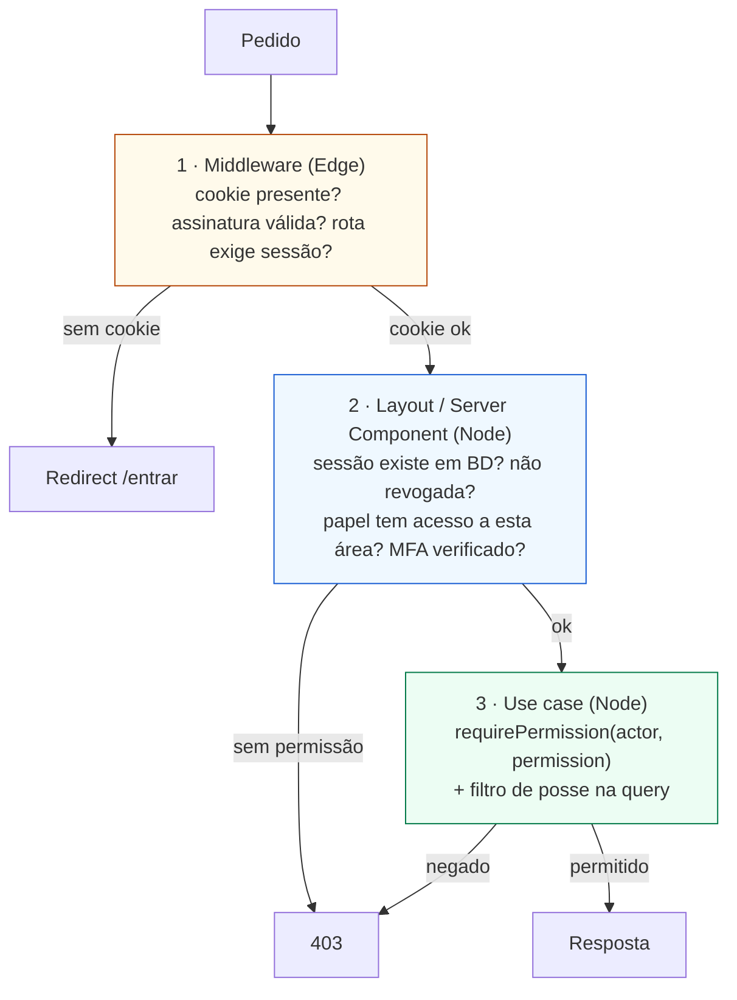
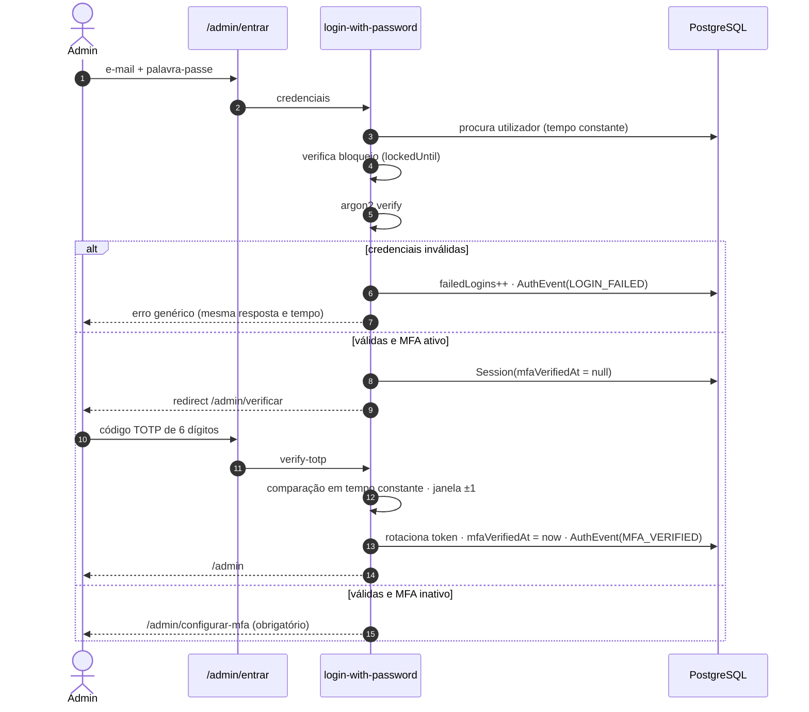

# VOL01 — Autenticação, RBAC e Estrutura Base

**Estado:** desenho concluído — **a aguardar aprovação para implementar**
**Data:** 2026-08-05
**Autorizado por:** aprovação formal da Fase P0

Documentos deste volume:
[`authentication.md`](../security/authentication.md) ·
[`rbac.md`](../security/rbac.md) ·
[`ADR-007`](../adr/ADR-007-authentication-provider.md) ·
[`ADR-008`](../adr/ADR-008-rbac-strategy.md)

---

## 1. Análise multi-agente

### Security Architect

**Superfície de ataque do VOL01:** formulário de login, recuperação de palavra-passe,
verificação TOTP, cookie de sessão, middleware de rota, endpoints de perfil.

| Ameaça | Vetor | Defesa | Verificação |
|---|---|---|---|
| Credential stuffing | Listas de senhas vazadas | Rate limit por IP e por conta + bloqueio progressivo + verificação contra listas conhecidas | Teste de carga com 100 tentativas |
| Enumeração de contas | Resposta diferente para e-mail existente vs. inexistente | **Resposta e tempo idênticos** em login e recuperação | Teste que compara respostas e mede latência |
| Fixação de sessão | Reutilizar token pré-autenticação | Token rotacionado no login e na elevação para MFA | Teste E2E compara tokens |
| Bypass de MFA | Aceder a `/admin` com sessão parcial | Sessão tem `mfaVerifiedAt`; middleware exige-o | Teste tenta aceder sem verificar |
| Roubo de cookie por XSS | Script injetado | `HttpOnly` + CSP com nonce | ZAP baseline + revisão de CSP |
| CSRF | Formulário externo | `SameSite=Lax` + verificação de origem em Server Actions | Teste com origem forjada |
| Escalada de privilégios | Manipular papel no cliente | **Papel nunca vem do cliente** — resolvido no servidor a cada pedido | Teste com token adulterado |
| Replay de token de recuperação | Reutilizar link de reset | Token de uso único, hash em BD, invalidado na utilização | Teste usa o mesmo token duas vezes |
| Timing attack em verificação de TOTP | Comparação não constante | Comparação em tempo constante | Revisão de código |
| Bloqueio de utilizador legítimo (DoS) | Atacante bloqueia conta alheia com tentativas falhadas | Bloqueio por **IP+conta**, não só por conta; notificação ao titular | Teste de bloqueio dirigido |

**Veto do Security Architect:** JWT como estratégia de sessão. Um JWT válido não se revoga
sem uma lista de revogação — que é uma sessão em base de dados com passos extra. Ver
[ADR-007](../adr/ADR-007-authentication-provider.md).

### Backend Lead

- `argon2` é dependência nativa. Verificar compatibilidade com o runtime da Vercel; se houver
  atrito, a alternativa aprovada é `@node-rs/argon2` (bindings Rust, sem `node-gyp`).
- **Middleware do Next corre no Edge Runtime** — sem acesso a Prisma nem a `argon2`. Logo, o
  middleware faz apenas verificação de presença e validade estrutural do cookie; a
  autorização real acontece nos layouts e nos use cases. Esta divisão é a decisão de arquitetura
  mais importante deste volume e está detalhada em §3.
- Sessão em BD acrescenta uma query por pedido autenticado. Mitigação: `select` mínimo, índice
  em `sessionToken`, e cache de 30 s por token em memória do processo (não partilhada — seguro).
- `failedLogins` e `lockedUntil` já existem no schema. Faltam: códigos de recuperação MFA,
  tokens de reset com hash e um registo dedicado de eventos de autenticação. Ver §7.

### Frontend Lead

- Três layouts, três experiências: público (sem sessão), cliente (magic link, mobile-first),
  admin (palavra-passe + TOTP, densidade alta).
- **O cliente angolano típico não quer criar palavra-passe.** Magic link por e-mail é o método
  principal do portal; palavra-passe é opcional e só para quem a quiser.
- Estados de erro em português claro: "E-mail ou palavra-passe incorretos" — nunca "utilizador
  não encontrado", que revela existência de conta.
- Formulários resilientes: em 3G instável, um duplo clique não pode gerar duas sessões nem dois
  e-mails. `useFormStatus` + idempotência no servidor.
- Guards do lado do cliente são **conveniência de UX**, nunca segurança. Um `useSession` que
  esconde um botão é cosmética; a proteção está no servidor.

### QA Lead

- Fluxo de login é o caminho crítico de tudo o resto — E2E obrigatório antes de qualquer merge.
- Testes de **negação**, não só de sucesso: cada papel tenta o que não pode e tem de falhar.
- Cobertura ≥ 80 % no domínio auth (exigência do volume); alvo interno 90 % para
  `permissions.ts` e a máquina de estados de sessão.
- Testes de tempo constante para enumeração são frágeis em CI; medir com tolerância generosa
  e marcar como não-bloqueante se der ruído — mas manter.

### DevOps & Observability Lead

- `AUTH_SECRET` e `MFA_ENCRYPTION_KEY` são segredos de produção; rotação documentada.
  Rodar `MFA_ENCRYPTION_KEY` exige re-encriptar todos os segredos TOTP — nunca rodar sem plano.
- Métricas desde o dia 1: taxa de sucesso de login, tentativas falhadas por hora, bloqueios,
  latência do login, uso de recuperação, ativações de MFA.
- Alerta P1: > 50 falhas de login em 5 min (ataque em curso). Alerta P2: pico de recuperações
  de palavra-passe.
- Sentry: nunca enviar e-mail, telefone ou token. `beforeSend` já configurado com scrubbing.

### Documentation Lead

Este volume produz 5 documentos. `CLAUDE.md` passa a referir `rbac.md` como fonte única da
matriz de permissões — **a matriz não pode existir em dois sítios**.

---

## 2. Objetivos e não-objetivos

**Objetivos**
Autenticação segura para três populações · RBAC completo e verificável · três layouts ·
middleware de proteção · sessões revogáveis · auditoria de autenticação imutável ·
onboarding inicial (primeira organização e primeiro `OWNER`).

**Não-objetivos deste volume**
SSO/SAML · WebAuthn/passkeys · login social (Google/Facebook) · convites de equipa em massa ·
gestão de dispositivos · impersonação de utilizador pelo suporte.

> Passkeys e login social ficam em aberto para VOL posterior. O schema (`Account`) já suporta
> OAuth sem migração destrutiva.

---

## 3. Arquitetura do módulo

```
src/modules/identity/
├── domain/
│   ├── entities/
│   │   ├── User.ts                 invariantes de conta, bloqueio, MFA
│   │   ├── Session.ts              validade, expiração, elevação MFA
│   │   └── Membership.ts           papel dentro da organização
│   ├── value-objects/
│   │   ├── Email.ts                normalização + validação
│   │   ├── Password.ts             política; nunca guarda texto claro
│   │   └── Permission.ts           tipo literal, não string solta
│   ├── policies/
│   │   ├── password-policy.ts      comprimento, listas conhecidas
│   │   ├── lockout-policy.ts       progressão do bloqueio
│   │   └── permissions.ts          MAPA PAPEL → PERMISSÕES (SSoT)
│   ├── events/
│   │   ├── UserLoggedIn.ts  UserLoginFailed.ts  UserLockedOut.ts
│   │   ├── MfaEnabled.ts    MfaDisabled.ts      PasswordChanged.ts
│   │   └── SessionRevoked.ts
│   └── ports/
│       ├── UserRepository.ts  SessionRepository.ts
│       ├── PasswordHasher.ts  TotpService.ts
│       └── AuthEventRecorder.ts
├── application/
│   ├── login-with-password.ts      verify-totp.ts
│   ├── login-with-magic-link.ts    request-password-reset.ts
│   ├── reset-password.ts           change-password.ts
│   ├── enable-mfa.ts               disable-mfa.ts
│   ├── revoke-session.ts           list-sessions.ts
│   ├── logout.ts                   onboard-organization.ts
│   └── require-permission.ts       ← ÚNICA função que autoriza (lança, não devolve bool)
├── infra/
│   ├── prisma-user-repository.ts   prisma-session-repository.ts
│   ├── argon2-password-hasher.ts   otplib-totp-service.ts
│   └── auth-config.ts              NextAuth v5
├── ui/
│   ├── LoginForm.tsx  MfaChallenge.tsx  PasswordResetForm.tsx
│   ├── SessionList.tsx  ProfileForm.tsx
│   └── PermissionGate.tsx          ← UX, não segurança
└── index.ts
```

### As três camadas de proteção

Esta é a decisão central do volume. **O middleware do Next corre no Edge Runtime e não tem
acesso à base de dados.** Fingir o contrário produz um sistema que parece protegido e não está.



| Camada | Runtime | Verifica | **Não** verifica |
|---|---|---|---|
| 1. Middleware | Edge | Presença e integridade do cookie; rota pública vs. protegida | Nada que exija base de dados |
| 2. Layout / RSC | Node | Sessão válida e não revogada; papel adequado à área; MFA verificado para `/admin` | Permissão fina por recurso |
| 3. Use case | Node | `authorize()` + filtro de posse na query | — |

**Regra:** a camada 3 é a única que autoriza de facto. As camadas 1 e 2 existem para
redirecionar cedo e evitar renderizar o que o utilizador não vai poder ver.

---

## 4. Modelo de permissões (resumo)

Detalhe completo em [`rbac.md`](../security/rbac.md). Decisão em
[ADR-008](../adr/ADR-008-rbac-strategy.md).

- **11 papéis** (revisto na consolidação da P0 — ver
  [`rbac-policy-final.md`](../security/rbac-policy-final.md) e
  [ADR-009](../adr/ADR-009-role-expansion.md)), cada um com um conjunto estático de permissões
  definido em código (`permissions.ts`), não em base de dados.
- **73 permissões.** `PHOTOGRAPHER`, `VIDEOGRAPHER`, `EDITOR` e `STAFF` têm **zero**
  permissões financeiras; apenas `OWNER` e `FINANCE_MANAGER` movem dinheiro.
- Permissão é `recurso:ação` — `booking:confirm`, `payment:override`, `file:download`.
- `Membership.permissions[]` permite **acrescentar** permissões pontuais a um utilizador;
  nunca remover as do papel. Concessões excecionais ficam auditadas.
- `CLIENT` não tem `Membership` — o seu acesso é resolvido por `ClientUser` e limitado por
  posse (`clientId`), nunca por permissão global.
- `authorize()` é a única função que decide. Não há verificação de papel espalhada por
  componentes.

---

## 5. Fluxos

### 5.1 Login de admin (palavra-passe + TOTP)



**Invariante:** uma sessão sem `mfaVerifiedAt` não acede a nenhuma rota `/admin` além da de
verificação e da de configuração.

### 5.2 Login de cliente (magic link)

```
1. Cliente introduz e-mail em /entrar
2. Resposta é SEMPRE "Se existir conta, enviámos um link" — nunca revela existência
3. Se existir: token de uso único (hash em BD), TTL 15 min, enviado por Resend
4. Clique → validação → sessão criada → token invalidado
5. AuthEvent(LOGIN_SUCCESS, method=MAGIC_LINK)
6. Rate limit: 3 pedidos por e-mail por hora
```

Palavra-passe é opcional para clientes; quem a definir pode usar as duas vias.

### 5.3 Recuperação de palavra-passe

```
1. Pedido em /recuperar → resposta genérica idêntica em todos os casos
2. Token de uso único, hash guardado, TTL 30 min
3. Reset → invalida o token → REVOGA TODAS AS OUTRAS SESSÕES → AuthEvent(PASSWORD_RESET)
4. E-mail de notificação ao titular: "a sua palavra-passe foi alterada"
5. Rate limit: 3/h por e-mail, 10/h por IP
```

### 5.4 Alteração de palavra-passe (autenticado)

Exige palavra-passe atual. Sucesso revoga todas as outras sessões e notifica por e-mail.

### 5.5 Logout

```
Logout normal:  apaga a sessão atual · limpa cookie · AuthEvent(LOGOUT)
Logout global:  apaga todas as sessões do utilizador · AuthEvent(LOGOUT_ALL)
Revogação:      o titular revoga uma sessão específica a partir do perfil
```

### 5.6 Onboarding inicial

```
Primeira execução: seed cria Organization + primeiro OWNER com palavra-passe temporária
Primeiro login: obriga a alterar palavra-passe → obriga a configurar TOTP → só então /admin
Convite de membro: token com TTL 7 dias, papel definido no convite, aceitação cria Membership
```

---

## 6. Estrutura base da aplicação (VOL01)

```
src/app/
├── (public)/                 layout público — sem sessão
│   ├── entrar/               login de cliente (magic link + palavra-passe)
│   ├── recuperar/            pedido de recuperação
│   ├── redefinir/[token]/    definição de nova palavra-passe
│   └── layout.tsx
├── (client)/cliente/         layout do portal — exige sessão CLIENT
│   ├── perfil/               dados, palavra-passe, sessões ativas
│   └── layout.tsx            guard server-side
├── (admin)/admin/
│   ├── entrar/               login de staff
│   ├── verificar/            desafio TOTP
│   ├── configurar-mfa/       ativação obrigatória
│   ├── perfil/  definicoes/utilizadores/
│   └── layout.tsx            guard server-side + exigência de MFA
├── api/auth/[...nextauth]/
└── middleware.ts
```

---

## 7. Alterações necessárias ao schema

O schema atual cobre quase tudo. Faltam quatro coisas — a aplicar por migração no início da
implementação:

```prisma
model User {
  // ... campos existentes
  mfaVerifiedAt        DateTime?   // NOVO — última verificação bem-sucedida
  passwordChangedAt    DateTime?   // NOVO — invalida sessões anteriores
  mustChangePassword   Boolean  @default(false)  // NOVO — onboarding
  mfaBackupCodes       MfaBackupCode[]           // NOVO
  authEvents           AuthEvent[]               // NOVO
  projectAssignments   ProjectAssignment[]       // JÁ APLICADO no schema (ADR-009)
}

model Session {
  // ... campos existentes
  mfaVerifiedAt DateTime?  // NOVO — sessão elevada; null = não passou o 2.º fator
  lastActiveAt  DateTime @default(now())  // NOVO — expiração por inatividade
}

// NOVO — códigos de recuperação MFA, guardados como hash
model MfaBackupCode {
  id       String    @id @default(cuid())
  userId   String
  user     User      @relation(fields: [userId], references: [id], onDelete: Cascade)
  codeHash String    @unique
  usedAt   DateTime?
  createdAt DateTime @default(now())

  @@index([userId, usedAt])
}

// NOVO — registo append-only de eventos de autenticação
model AuthEvent {
  id        String        @id @default(cuid())
  userId    String?
  user      User?         @relation(fields: [userId], references: [id], onDelete: SetNull)
  email     String?       // tentativa em conta inexistente
  type      AuthEventType
  success   Boolean
  method    AuthMethod?
  ip        String?
  userAgent String?
  reason    String?
  at        DateTime      @default(now())

  @@index([userId, at])
  @@index([email, at])
  @@index([type, at])
}

enum AuthEventType {
  LOGIN_SUCCESS  LOGIN_FAILED   LOGOUT   LOGOUT_ALL
  MFA_VERIFIED   MFA_FAILED     MFA_ENABLED  MFA_DISABLED
  PASSWORD_RESET_REQUESTED  PASSWORD_RESET  PASSWORD_CHANGED
  ACCOUNT_LOCKED  ACCOUNT_UNLOCKED
  SESSION_REVOKED  MAGIC_LINK_SENT  MAGIC_LINK_USED
  BACKUP_CODE_USED  ROLE_CHANGED
}

enum AuthMethod {
  PASSWORD  MAGIC_LINK  TOTP  BACKUP_CODE  OAUTH
}
```

> **Porquê `AuthEvent` separado de `AuthLog`/`AuditLog`:** `AuditLog` regista alterações de
> estado do negócio, com `before`/`after`. Eventos de autenticação são de outra natureza,
> muito mais frequentes, e precisam de índices por e-mail (incluindo tentativas em contas
> inexistentes, que não têm `userId`). Misturá-los degradaria as consultas de auditoria de
> negócio. Ambos são append-only, com `UPDATE`/`DELETE` revogados na base de dados.

---

## 8. Riscos do VOL01

| # | Risco | Prob. | Impacto | Mitigação |
|---|---|---|---|---|
| A1 | **Middleware Edge sem acesso a BD leva a proteção ilusória** | Alta | **Crítico** | Arquitetura de 3 camadas (§3); teste que confirma que o middleware sozinho não autoriza |
| A2 | `argon2` incompatível com o runtime da Vercel | Média | Alto | Validar na primeira semana; alternativa `@node-rs/argon2` já aprovada |
| A3 | Implementação de auth caseira com falha subtil | Média | **Crítico** | Só primitivas de biblioteca; OWASP ASVS L2 como checklist; ZAP em CI; revisão dedicada |
| A4 | Query de sessão por pedido degrada latência | Média | Médio | `select` mínimo, índice, cache curto em memória; medir p95 |
| A5 | Perda de `MFA_ENCRYPTION_KEY` | Baixa | **Crítico** | Backup do segredo; códigos de recuperação; procedimento de reposição documentado |
| A6 | Utilizador perde acesso ao TOTP | Alta | Médio | 10 códigos de recuperação; reposição por outro `OWNER` com auditoria `CRITICAL` |
| A7 | E-mails de magic link em spam | Alta | Alto | SPF, DKIM e DMARC verificados **antes** do primeiro teste real |
| A8 | Bloqueio de conta usado como DoS dirigido | Média | Médio | Bloqueio por IP+conta; notificação ao titular; desbloqueio por `OWNER` |
| A9 | Matriz de permissões duplicada entre código e documentação | Alta | Médio | `permissions.ts` é SSoT; teste que compara o mapa com a tabela de `rbac.md` |

---

## 9. Plano de testes

### Unitários (Vitest) — alvo ≥ 90 % em `domain/`

| Alvo | Casos |
|---|---|
| `password-policy` | Comprimento, senhas comuns, unicode, limite superior |
| `lockout-policy` | Progressão 1→5→15→60 min; reposição após sucesso |
| `permissions.ts` | Cada papel × cada permissão — 803 células, não amostra |
| `Session` | Expiração, inatividade, elevação MFA, invalidação por mudança de senha |
| `Email` (VO) | Normalização, maiúsculas, espaços, formatos inválidos |
| Máquina de estados de sessão | Todas as transições válidas e inválidas |

### Integração (Vitest + Postgres em contentor)

- Login com credenciais válidas cria exatamente uma sessão
- Login falhado incrementa `failedLogins` e escreve `AuthEvent`
- 5 falhas bloqueiam; 6.ª tentativa é recusada mesmo com senha correta
- Reset de palavra-passe revoga todas as outras sessões
- Token de reset não funciona duas vezes
- Código de recuperação MFA não funciona duas vezes
- `AuthEvent` não aceita `UPDATE` nem `DELETE` (verificação a nível de BD)
- Sessão revogada deixa de autenticar no pedido seguinte

### E2E (Playwright) — bloqueiam merge

| # | Cenário | Resultado esperado |
|---|---|---|
| 1 | Cliente entra por magic link | Chega a `/cliente` |
| 2 | Admin entra com senha + TOTP | Chega a `/admin` |
| 3 | Admin com senha correta mas **sem** TOTP tenta `/admin/financeiro` | Redirect para `/admin/verificar` |
| 4 | Cliente tenta aceder a `/admin` | 403, e o evento fica registado |
| 5 | `STAFF` tenta aceder a `/admin/financeiro` | 403 |
| 6 | `SALES` tenta confirmar um pagamento por API | 403 |
| 7 | Cliente A tenta ver reserva do cliente B | 404 (não 403 — não revela existência) |
| 8 | Logout invalida a sessão | Pedido seguinte redireciona para login |
| 9 | Revogar sessão noutro dispositivo | Esse dispositivo perde acesso |
| 10 | 5 logins falhados bloqueiam a conta | 6.ª tentativa recusada com senha correta |
| 11 | Recuperação: e-mail inexistente | Resposta idêntica à de e-mail existente |
| 12 | Reset de senha termina as outras sessões | Sessão antiga deixa de funcionar |
| 13 | Duplo clique no login | Uma só sessão criada |
| 14 | Código de recuperação MFA usado duas vezes | Segunda tentativa falha |

### Segurança

`npm audit` · `gitleaks` · ZAP baseline · verificação de cabeçalhos e CSP · teste de tempo
de resposta para enumeração (não-bloqueante se der ruído em CI, mas monitorizado).

> **Testes 15–25 adicionais** exigidos pela política final estão em
> [`rbac-policy-final.md §7`](../security/rbac-policy-final.md) — incluindo o teste 25:
> os 5 papéis sem financeiro × as 11 permissões financeiras = **55 × 403**.

### Cobertura exigida

| Alvo | Mínimo |
|---|---|
| `modules/identity/domain/**` | **90 %** (o volume exige 80; subimos por ser auth) |
| `modules/identity/application/**` | 85 % |
| `permissions.ts` | **100 %** |
| Global do módulo | 80 % |

---

## 10. Definition of Done do VOL01

- [ ] Todos os 14 cenários E2E verdes
- [ ] Cobertura acima dos mínimos de §9
- [ ] `tsc --noEmit` strict, zero `any`, zero `@ts-ignore`
- [ ] Middleware, layouts e use cases com as três camadas implementadas e testadas
- [ ] `AuthEvent` e `AuditLog` com `UPDATE`/`DELETE` revogados, verificado por teste
- [ ] Cookies `__Host-`, `HttpOnly`, `Secure`, `SameSite=Lax` confirmados em resposta real
- [ ] MFA obrigatório e inescapável em `/admin`
- [ ] Sessões revogáveis a partir do perfil, com efeito imediato
- [ ] SPF, DKIM e DMARC verificados no domínio de envio
- [ ] Rate limiting ativo e testado em todos os endpoints de auth
- [ ] `permissions.ts` coincide com a tabela de `rbac.md` (teste automático)
- [ ] Testado em telemóvel real e em 3G simulado
- [ ] Documentação atualizada; ADR-007 e ADR-008 aprovados
- [ ] Relatório de conclusão com testes executados e riscos remanescentes

---

## 11. Sequência de implementação proposta

| # | Passo | Depende de |
|---|---|---|
| 1 | Scaffold Next.js + TS strict + Tailwind + CI (typecheck, lint, test, build) | — |
| 2 | Prisma + Postgres + migração inicial + deltas de auth (§7) + seed | 1 |
| 3 | `domain/` do identity: entidades, políticas, `permissions.ts` + testes unitários | 2 |
| 4 | `infra/`: repositórios, `argon2`, `otplib`, config NextAuth | 3 |
| 5 | Use cases de login, logout, sessões + testes de integração | 4 |
| 6 | Middleware + layouts + guards (3 camadas) | 5 |
| 7 | UI: login cliente, login admin, TOTP, recuperação, perfil, sessões | 6 |
| 8 | Recuperação e alteração de palavra-passe + e-mails (Resend) | 7 |
| 9 | Onboarding: seed da organização, primeiro `OWNER`, convites | 8 |
| 10 | E2E completos + endurecimento + rate limiting | 9 |
| 11 | Relatório de conclusão e pedido de aprovação do VOL02 | 10 |

**Estimativa:** 8–10 dias úteis para um programador a tempo inteiro.

---

## 12. Dependências externas antes de começar

| Dependência | Necessária para | Quem |
|---|---|---|
| Base de dados PostgreSQL (dev + preview) | Passo 2 | Técnico |
| Domínio de envio com SPF/DKIM/DMARC + chave Resend | Passo 8 | Técnico |
| Decisão: e-mail remetente (`geral@` ou `nao-responder@`) | Passo 8 | Negócio |
| Lista de membros da equipa e respetivos papéis | Passo 9 | Negócio |

Nenhuma destas bloqueia o arranque nos passos 1–7.
